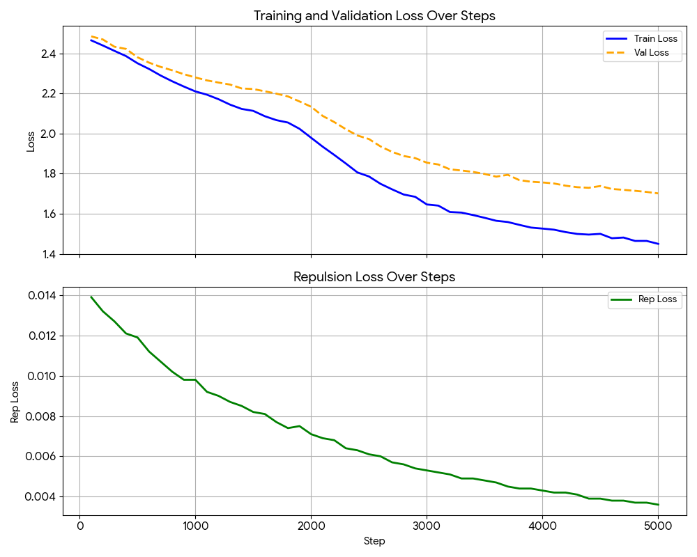

# Newton Gravity Transformer (NGT)

### *"Words are Particles, Attention is Gravity"*

[](https://www.python.org/downloads/)
[](https://pytorch.org/)
[](LICENSE)

**NGT** is a personal experimental project that explores a radical alternative to the standard Transformer: replacing Dot-product Attention with a physics-informed **Gravity Kernel**.

[Architecture](#architecture) • [Mathematical Concept](#mathematical-concept) • [Installation](#installation) • [Usage](#usage) • [Contribution](#contribution)

---

## 💡 Project Background

Hi! I'm **Taegyu Lee**, an undergraduate student passionate about AI.

This project was born from a simple curiosity: *"What if semantic relationships followed the laws of motion and gravity?"* The entire development process embraced the **Vibe Coding** methodology—prioritizing a rapid, iterative creative flow to translate abstract physical metaphors into a functional neural architecture.

NGT isn't just a model; it's an exploration of **Geometric Interpretability**. By assigning physical properties like mass and coordinates to tokens, users can visualize the "gravity" of language in a way that standard attention heatmaps cannot.

---

## 🌌 Core Concept

While standard Transformers compute similarity using vector magnitudes and angles (Dot-product), NGT introduces a **Metric Structure** based on **Distance ($r$)** and **Mass ($m$)**.

### 1. Gravity Attention
Instead of statistical pattern matching, NGT models the "attraction" between tokens. A high-mass token (e.g., a subject or a key keyword) exerts a stronger gravitational pull on nearby tokens, naturally forming a context-aware orbit.

### 2. Learnable Sparse Attention (Radius Cutoff)
NGT implements an adaptive sparsity mechanism. Each layer learns its own **interaction radius**. If the latent distance between two tokens exceeds this learnable threshold, they are masked out. This allows the model to dynamically decide the scope of its local vs. global attention.

### 3. Coordinate Evolution (Neural ODE-like Flow)
In NGT, the depth of the network represents a flow in time. Tokens don't just update their semantic vectors; their locations in the latent manifold evolve across layers based on their interactions, similar to particles moving through a gravitational field.

---

## 🏗️ Architecture

### Dual-Stream Co-Evolution

NGT maintains two synchronized data streams:
- **Hidden States ($h$):** The semantic "cargo" of the token (Standard Transformer flow).
- **Latent Coordinates ($z$):** The geometric "position" of the token (Geometric flow).

```python
# The "Physical" Attention Score Formula
Score(i, j) = -gamma * (mass_i * mass_j) / (distance(i, j)**2 + epsilon)
```

As the token semantics ($h$) update, they drive the movements of the coordinates ($z$), which in turn changes the attention patterns for the next layer.

---

## 🔢 Mathematical Concept (Abstracted)

### 1. Gravity Attention Kernel

$$\text{Score}_{ij} = -\gamma \cdot \frac{m_i \cdot m_j}{\|z_i - z_j\|^2 + \epsilon}$$

- **$\gamma$ (Gravitational Constant)**: A learnable parameter controlling the overall interaction strength.
- **$m$ (Mass)**: Learned scalar representing the token's "importance" or "pull".
- **$z$ (Coordinates)**: Token position in a low-dimensional latent manifold $(d=16, 32)$.

### 2. Adaptive Sparsity

$$\text{Mask}_{ij} = \mathbb{1}\left[\|z_i - z_j\|^2 > r^2\right]$$

The model optimizes the radius $r$ through training, enabling it to focus on "gravitationally significant" clusters while safely ignoring distant noise.

---

## 🚀 Installation & Usage

### 1. Getting Started
```bash
git clone https://github.com/leetae9yu/newton-gravity-transformer.git
cd newton-gravity-transformer
pip install -r requirements.txt
```

### 2. Quick Run (TinyShakespeare)
```bash
# Download dataset
python prepare_data.py

# Train the model
python train_shakespeare.py --max-steps 5000

# Chat with the model
python chat.py --checkpoint-path checkpoints_ideal/shakespeare.pt_best.pt
```

---

## 📊 Results

### Generated Samples (v0.1, 5k steps)

> **ROMEO:**
> Will see rey did never the id their be very sound.
>
> **GREMIO:**
> Ay, do fairst, leady the dead his of Paul prison tame
> More execute mariage uper; where so do queen;
> All pergeant you wented, all in persaks and din man;
> The droubland ho great that soppsure
> The the ayou commmonand lord make your 's perjustce;
> On and them thou tirdd ust childred-shap him with estren,
> Or our where not war, we have sweet fr

> **ANGELO:**
> I say, to not I will not to for anin that say befrormanter?
>
> **QUEEN:**
> Has here; then imperated here to be no friends to steate
> To from beatie in a lleasure blow,
> And bad the pothrod my country; I gracious and of play
> This struing your means some was fith him.

The model successfully captures the **syntactic structure** of the play script format (Speaker names, line breaks) and **Shakespearean vocabulary** (thou, lord, queen, gracious). With only 5,000 steps of training on a char-level tokenizer, it demonstrates the emergence of structural understanding from gravitational attention.

<div align="center">
  
  <p><em>Figure 1: Training Loss Curve (5k steps)</em></p>
</div>

---

## 🤝 Contribution & Feedback

As this is an undergraduate personal project, there is plenty of room for improvement! I am always open to **PRs**, **Issues**, or casual discussions regarding:

- **Mathematical Refinement**: Optimizing the gravity potential and repulsion parameters.
- **New Physics Metaphors**: Ideas for integrating electromagnetism, fluid dynamics, or thermodynamic entropy.
- **Hardware Optimization**: Improving the performance of the vectorized distance calculations.
- **Interpretability Tools**: New ways to visualize the latent manifold evolution.

Feel free to open an issue or submit a PR at any time!

---

## 🗺️ Roadmap: The Future

1. **Advanced Tokenization**: Currently, NGT uses a **Character-Level Tokenizer** to minimize memory overhead for environment constraints (e.g., Google Colab T4 GPUs). However, to truly realize the *"Words are Particles"* philosophy, I plan to transition to **Subword Tokenizers (BPE / Tiktoken)**. This will allow the model to interact with higher-level semantic units as individual physical particles.

2. **Integration with Stable Diffusion**: One of the most exciting future phases for NGT is the **Integration with Stable Diffusion**. By aligning the NGT coordinate space with the latent space of Diffusion models, I aim to use "Semantic Gravity" to guide image generation—allowing physical masses in text to act as literal anchors for visual objects.

3. **Visualization**: Because NGT currently uses a Character-Level Tokenizer, I thought that this project doesn't need any visualization yet. But, after I swithch to Subword Tokenizers, I plan to implement some visualization tools to help users understand the latent manifold evolution.

4. **Naming**: There are some codes that say this project **HGT(Hierarchical Gravity Transformer)**, which was an initial name of this project. I changed it to **NGT(Newton Gravity Transformer)** because HGT is already known as **Heterogeneous Graph Transformer**.

---

## License

This project is licensed under the [MIT License](LICENSE).

---

<div align="center">

**[⬆ Back to Top](#newton-gravity-transformer-ngt)**

</div>
